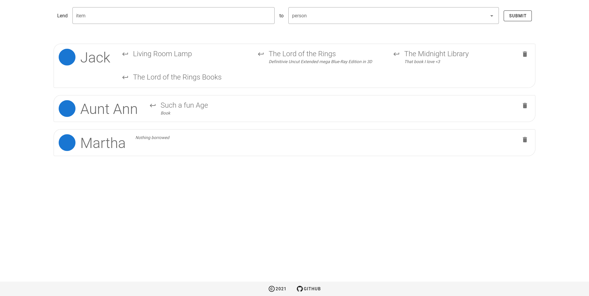

# BorrowList3000

<i>Simple application to keep track of who borrowed what stuff</i>



## Deployment

This application can be deployed using three different methods which are described in the following sections.

### On Docker

A docker image is built automatically that follows the master branch of the repository.
It is available as `ghcr.io/ftsell/borrowlist3000:dev-latest`.
Tagged images for each release are also available as `ghcr.io/ftsell/borrowlist3000:<release>`.

### On Kubernetes

A kubernetes configuration is included in this repository as [kustomization](https://kustomize.io/).
It can be rendered via `kustomize build https://github.com/ftsell/BorrowList3000.git` or applied to your cluster
via `kustomize build https://github.com/ftsell/BorrowList3000.git | kubectl apply -f -`.

### On Baremetal from source

To build the application from source, follow the following steps:
```shell
git clone https://github.com/ftsell/BorrowList3000.git
cd BorrowList3000
yarn install
cd packages/BorrowList3000Frontend
yarn run build
```

To start it:
```shell
yarn run start
```

And to install an update:
```shell
git pull
yarn install
yarn run build
```

## Configuration

The application is configured at runtime via the following environment variables:

| Name | Is Required? | Description |
|------|---------|-------------|
| BL_SESSION_SECRET | *required* | A secret key that is used to authenticate session cookies. |
| BL_DB_DIALECT | *required* | The database dialect that should be used. Can be one of *mysql*, *postgres*, *sqlite* or *mssql*. |
| BL_DB_HOST | *required except for sqlite* | The database host |
| BL_DB_PORT | *required except for sqlite* | The database port |
| BL_DB_USERNAME | *required except for sqlite* | The username used to authenticate at the database host |
| BL_DB_PASSWORD | *required except for sqlite* | The password used to authenticate at the database host |
| BL_DATABASE | *required* | Database to use on the database host or path when using *sqlite* |
| BL_DB_MIGRATE | *not required* | Automatically apply database migrations on system startup. Must be equal to "true" to take effect. |

The following additional configuration options can be used but are only really useful for development purposes:

| Name | Is Required? | Description |
|------|--------------|-------------|
| BL_DEBUG | *not required* | Turns on debugging information. Must be equal to "true" to take effect. |
| BL_ALLOW_DB_RESET | *not required* | Turn on an **unauthenticated** endpoint in the API that allows completely truncating all database tables. | 

## Software Architecture

The software ist composed of a *backend* which serves a GraphQL API that is consumed by a *frontend*.

### Backend

The *backend* package is located at [packages/BorrowList3000Backend](./packages/BorrowList3000Backend).
It is in itself a rather simple application that uses [sequelize](https://sequelize.org/) in its database layer and
serves a GraphQL API to interact with that database.
Additionally, it enforces validation and access-control rules.

It can be started either directly via `yarn run start` or included in a [NuxtJS](https://nuxtjs.org/) application
as a [module](https://nuxtjs.org/docs/2.x/configuration-glossary/configuration-modules).


### Frontend

The *frontend* package is located at [packages/BorrowList3000Frontend](./packages/BorrowList3000Frontend).
It is a [NuxtJS](https://nuxtjs.org/) application (meaning [Vue](https://vuejs.org/) plus a few extras).
The package contains its own *README* that explains the directory structure and how to interact with *NuxtJs*.

The important part is, that in addition to rendering the user facing web application, it includes the *backend* as a
[module](https://nuxtjs.org/docs/2.x/configuration-glossary/configuration-modules) so it is started alongside the 
*frontend* automatically.

It can be started via `yarn run dev`.
